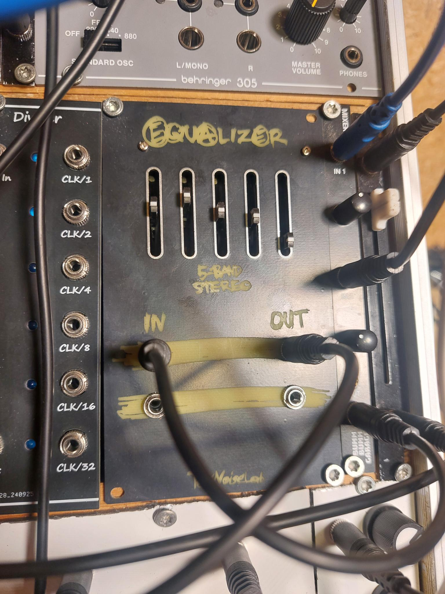

# 5-band-eq-eurorack-adapter
This is an adapter to use the cheap 5-band EQ module from China in an Eurorack system.
It has 2 channels, so you can use it as a stereo EQ or just use one channel if your system is mono.
The front panel is 15HP wide.

## Build
- Order the PCBs from the PCB manufacturer of your choice.
- Order the components from your favorite electronics supplier.
- Order the EQ205 module from anywhere you like. (for example: https://www.ebay.de/itm/233702952671?chn=ps&_ul=DE&google_free_listing_action=view_item or https://de.aliexpress.com/item/1005006833068678.html)
- Solder the components to the adapter PCB.
- Remove the plastic from the 7-Pin connector of the EQ module. (see images)
- Solder the adapter PCB to the EQ module. (The 7 pins from the connector)
- Attach the front panel to the adapter PCB.
- As distance bolts between the eq-board and the front panel I used the 3d printed distance_bolt.stl (2x) from the STL folder together with M2 screws from the front panel. At the back I just heated up the PLA and pressed it flat on the eq-board. (see images)
But you can also use normal distance bolts and screws or whatever you like.

